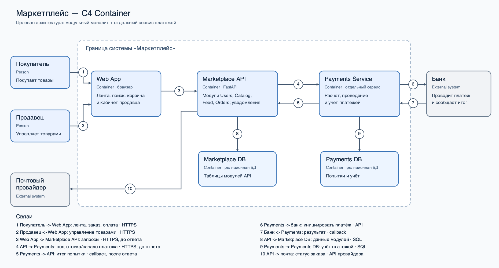

# C4 Container: маркетплейс

Диаграмма показывает **целевую архитектуру**. На текущем этапе реализован только каркас `Marketplace API` с `/health`. `Web App`, `Payments Service`, базы данных и внешние интеграции пока не реализованы.

`Container` в C4 — самостоятельно запускаемая часть системы, а не обязательно Docker-контейнер. `Users`, `Catalog`, `Feed` и `Orders` — модули **одного** `Marketplace API`, поэтому они указаны внутри его карточки, а не изображены отдельными контейнерами. Уведомления о статусах находятся в `Orders`.

Номера на стрелках раскрыты в легенде внутри диаграммы. Стрелки 4 и 5 разведены по отдельным линиям: запрос на платёж требует ответа до завершения операции, а окончательный результат может прийти позже. Файл [container.svg](container.svg) — редактируемый векторный оригинал.
